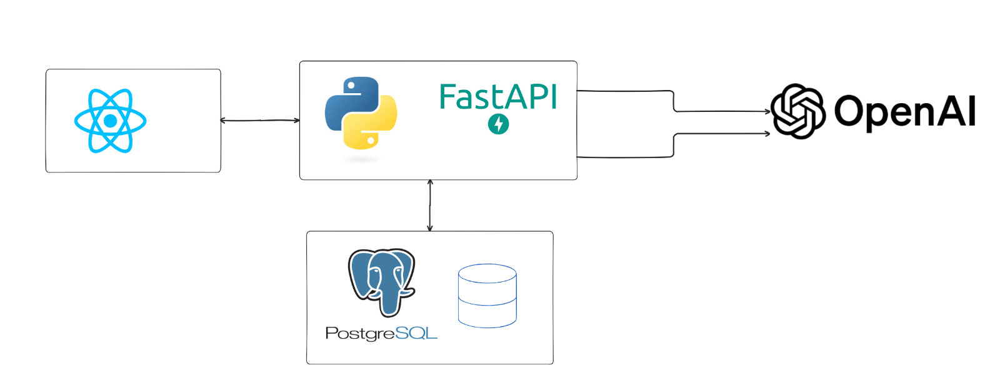

# RoomBooking - Sistem Management Rezervare Spatii

## Cuprins

- [Despre Proiect](#despre-proiect)
- [Arhitectura Sistemului](#arhitectura-sistemului)
- [Functionalitati](#functionalitati)
- [Tehnologii](#tehnologii)
- [Instalare si Rulare](#instalare-si-rulare)

---

## Despre Proiect

RoomBooking este o platforma avansata de management si rezervare spatii, dezvoltata pentru Molson Coors in cadrul SmartHack. Sistemul ofera gestionare completa a spatiilor de lucru, meeting rooms, zone de relaxare si evenimente, cu planificare asistata de inteligenta artificiala.

**Problema rezolvata:** Optimizarea utilizarii spatiilor de lucru prin rezervari inteligente, colaborare facilitata intre echipe si planificare automata a evenimentelor.

---

## Arhitectura Sistemului



Aplicatia utilizeaza o arhitectura microservices containerizata cu Docker:

- **Frontend Container**: React + TypeScript (Port 5173)
- **Backend Container**: FastAPI + Python (Port 8000)
- **Database Container**: PostgreSQL 15 (Port 5432)

Toate componentele comunica printr-o retea Docker privata (roombooking_network).

---

## Functionalitati

### Frontend (React + TypeScript)

**1. Sistem de Autentificare**
- Inregistrare si autentificare utilizatori
- Roluri: User si Manager
- JWT token-based authentication
- Protected routes

**2. Gestionare Camere**
- Vizualizare lista camere cu filtrare si sortare
- Filtre: nume, capacitate minima, pret maxim
- Detalii camere: capacitate, pret, amenitati, imagini
- Tipuri spatii: Meeting Rooms, Phone Booths, Beer Points, Billiard Rooms

**3. Sistem Rezervari**
- Calendar interactiv pentru selectare data
- Slot-uri orare: 7:00 - 22:00
- Verificare disponibilitate real-time
- Rezervari cu participanti multipli
- Status: Upcoming, Completed, Cancelled, Pending Approval
- Anulare rezervari

**4. AI Event Planner**
- Planificare multipla evenimente pe o zi
- Input: activitati cu ore, participanti, amenitati necesare, preferinte
- Procesare prin OpenAI GPT
- Sugestii camere cu confidence score si explicatii
- Alternative pentru fiecare activitate
- Estimare cost total
- Confirmare bulk bookings

**5. Invitatii si Notificari**
- Sistem de invitatii pentru participanti
- Notificari real-time cu badge
- Accept/Reject invitatii
- Tracking status raspunsuri

**6. Dashboard Manager (Doar Manageri)**
- Vizualizare rezervari in asteptare
- Aprobare/Respingere rezervari
- Management camere (create, update, delete)

**7. Harti Interactive 2D**
- Plan de etaj SVG
- Obiecte interactive (camere, mese, scaune, plante)
- Zoom si pan
- Statistici: total camere, disponibilitate, rata ocupare, pret mediu

**8. Sistem Avatare**
- 100+ avatare in 28 stiluri diferite
- Paginare si preview
- Personalizare profil

### Backend (FastAPI + Python)

**1. Authentication API**
- POST /auth/register - Inregistrare utilizator
- POST /auth/login - Autentificare (returneaza access + refresh tokens)
- POST /auth/refresh - Reinnoire access token

**2. Users API**
- GET /users/me - Informatii utilizator curent
- PUT /users/me - Update profil
- GET /users - Lista utilizatori (pentru participanti)

**3. Rooms API**
- GET /rooms - Lista camere cu filtrare (search, capacity, price, availability)
- GET /rooms/{id} - Detalii camera
- POST /rooms - Creare camera (manager only)
- PUT /rooms/{id} - Update camera (manager only)
- DELETE /rooms/{id} - Stergere camera (manager only)

**4. Bookings API**
- GET /bookings/my-bookings - Rezervarile utilizatorului
- GET /bookings/my-schedule - Program complet utilizator
- GET /bookings/room/{id} - Rezervari pentru o camera
- POST /bookings/check-availability - Verificare disponibilitate
- POST /bookings - Creare rezervare
- PUT /bookings/{id} - Update rezervare
- POST /bookings/{id}/cancel - Anulare rezervare
- DELETE /bookings/{id} - Stergere rezervare

**5. Event Suggestions API (AI)**
- POST /event-suggestions/suggest - Obtine sugestii AI pentru evenimente
- POST /event-suggestions/confirm-bulk - Confirmare rezervari multiple

**6. Notifications API**
- GET /notifications - Lista invitatii cu filtrare (unread_only)
- GET /notifications/count - Numar notificari necitite
- POST /notifications/{id}/accept - Acceptare invitatie
- POST /notifications/{id}/reject - Respingere invitatie

**7. Avatars API**
- GET /avatars/styles - Lista stiluri avatar disponibile
- GET /avatars/list - Lista avatare paginate
- GET /avatars/generate - Generare avatar custom

**8. Business Logic**
- Validare disponibilitate camere (verificare conflicte)
- Validare capacitate (numar participanti vs capacitate camera)
- Validare interval orar (7:00-22:00)
- Validare participanti (verificare disponibilitate participanti)
- Integrare OpenAI pentru analiza evenimente si recomandari camere
- Sistem aprobare rezervari (pending/approved/rejected)

**9. Database Models**
- Users (id, email, username, full_name, hashed_password, is_manager, avatar_url)
- Rooms (id, name, description, capacity, price, amenities, image, svg_id, coordinates, is_available)
- Bookings (id, room_id, user_id, booking_date, start_time, end_time, status)
- Booking_Participants (many-to-many: bookings - users)
- Booking_Invitations (id, booking_id, user_id, status, read)

---

## Tehnologii

### Frontend
- React 18 + TypeScript
- Vite (build tool)
- Shadcn/UI + Radix UI + Tailwind CSS
- React Three Fiber + Three.js (3D graphics)
- TanStack Query (server state)
- React Hook Form + Zod (forms & validation)
- Axios (HTTP client)
- date-fns (date manipulation)

### Backend
- FastAPI 0.115.0
- Python 3.8+
- SQLAlchemy 2.0 (ORM)
- PostgreSQL 15
- AsyncPG (async PostgreSQL driver)
- python-jose (JWT)
- passlib + bcrypt (password hashing)
- OpenAI SDK 1.12.0 (AI integration)
- Pydantic 2.10.0 (validation)

### Infrastructure
- Docker + Docker Compose
- PostgreSQL 15 Alpine

---

## Instalare si Rulare

### Prerequisite
- Docker si Docker Compose instalate
- Git

### Instalare Rapida

**1. Cloneaza repository:**

```
git clone <repository-url>
cd RoomBooking
```

**2. Porneste aplicatia:**

```
docker-compose up -d
```

**3. Verifica status:**

```
docker-compose ps
```

**4. Acceseaza aplicatia:**

- Frontend: http://localhost:5173
- Backend API: http://localhost:8000
- API Docs: http://localhost:8000/api/v1/docs

**5. Credentiale initiale:**

- Email: admin@example.com
- Password: Admin123!
- Role: Manager

### Comenzi Utile

**Opreste aplicatia:**
```
docker-compose down
```

**Rebuild dupa modificari:**
```
docker-compose up -d --build
```

**Vezi logs:**
```
docker-compose logs -f
```

**Logs specific:**
```
docker-compose logs -f backend
docker-compose logs -f frontend
docker-compose logs -f postgres
```

**Acceseaza containerul backend:**
```
docker-compose exec backend bash
```

**Acceseaza PostgreSQL:**
```
docker-compose exec postgres psql -U postgres -d roombooking
```

**Sterge tot (inclusiv date):**
```
docker-compose down -v
```

### Configurare (Optional)

Pentru productie, editeaza `docker-compose.yml`:

- SECRET_KEY: genereaza un key securizat
- OPENAI_API_KEY: adauga API key-ul tau OpenAI
- FIRST_SUPERUSER_EMAIL/PASSWORD: schimba credentialele admin
- BACKEND_CORS_ORIGINS: configureaza domeniile permise
